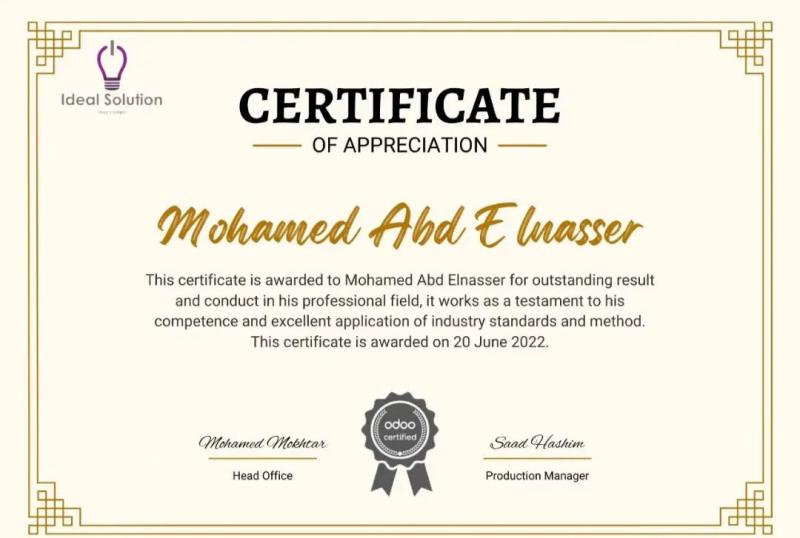
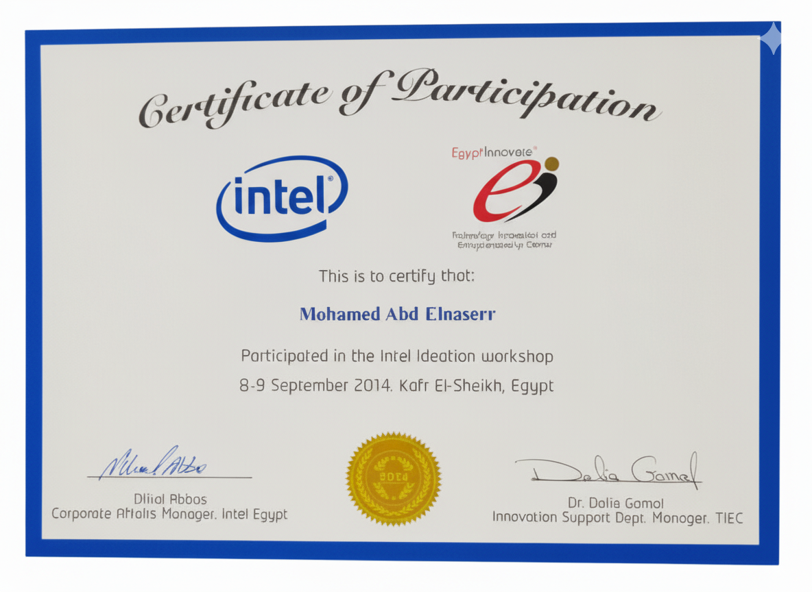
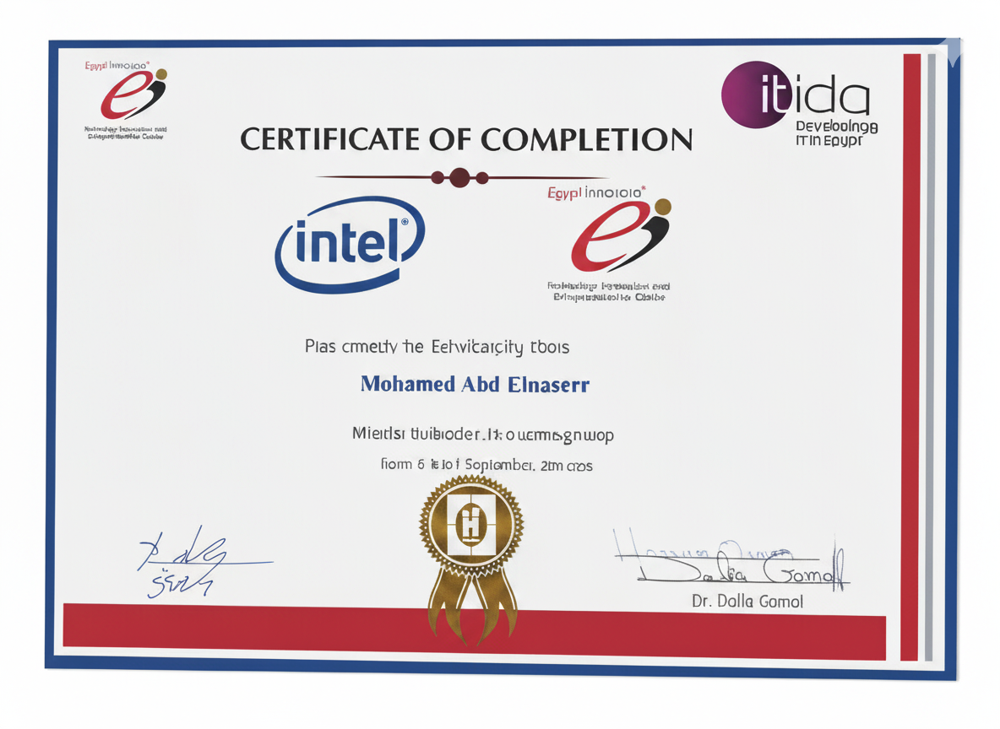

<h1 align="center">Hey 👋 I'm Mohamed Abd Elnasser</h1>

💻 Senior Odoo & Python Developer | ERP Solutions | API Integrations | Mobile Apps (Flutter/Android)

---

## 📜 Certifications & Awards

<table align="center">
  <tr>
    <td align="center">
       
      <b>Ideal Solution</b> Awarded Jun 20, 2022
    </td>
    <td align="center">
       
      <b>AICTEC Advance Int. Co.</b> Awarded Dec 3, 2024
    </td>
    <td align="center">
       
      <b>Innovation Award</b>  sep 9,2014
    </td>
    <td align="center">
       
      <b>Itida Certificate</b>  sep 9,2014
    </td>
  </tr>
</table>

---

## 👨‍💻 About Me
Passionate Software Engineer & Odoo Developer with hands-on experience designing, customizing, and deploying ERP solutions across multiple industries.  
Core strengths: module development, secure record rules, API integrations, performance tuning, and mobile-backend integration.

**Core areas**
- Odoo customization & module development (v12 → v17)  
- Backend: Python, PostgreSQL, ORM patterns, security & record rules  
- Frontend: OWL, XML, QWeb, JavaScript  
- DevOps: Linux, Nginx, SSL/TLS, Docker  
- Mobile: Flutter & Android (Odoo REST APIs)

---

## 🚀 Experience (Selected)
**Senior Python Odoo Developer — AICTEC Advance International Co., Saudi Arabia**  
*May 2021 – Present*  
- Delivered Odoo solutions for Sales, Inventory, Accounting & CRM.  
- Built QWeb reports (PDF/XLSX) and implemented record rules & ACLs.  
- Integrated third-party APIs and managed production deployments (Nginx, SSL).

**Senior Python Odoo Developer — Touch Business Solutions (Part-Time), Saudi Arabia**  
*Apr 2024 – Sep 2024*  
- Led the dev team: code reviews, best practices, and mentoring.

**Senior Python Odoo Developer — Top Genius Solutions (Part-Time), Egypt**  
*Oct 2024 – Present*

**Python Odoo Developer — Ideal Solution (Part-Time), Egypt**  
*Jan 2022 – May 2023*

**Mobile App Technical Lead — Aljeraisy HR, Saudi Arabia**  
*Feb 2021 – Jan 2022*  
- Led mobile development and Odoo backend integration.

**Mobile Android Developer — Mob Leaders Software (Freelance)**  
*2020*

---

## 🏆 Selected Projects
- **Marketko App** — Odoo ERP + POS + Kitchen Display System (KDS)  
- **Al-Attar Restaurant POS** — Fast-food workflows (delivery & takeaway)  
- **Ceramica Platino ERP** — Sales, Inventory, Manufacturing, Accounting  
- **Nrsen Cosmetics ERP** — Batch tracking, expiry management, POS & eCommerce  
- **Cargo Mobile App** — Flutter e-commerce app with Odoo REST backend  
- **REDOS Mobile App** — Android app (integration & maintenance)

---

## 🎓 Education
**B.Sc. Computer & Information Sciences** — Mansoura University  
*2013 – 2017 | GPA: 3.0*

---

## 🛠️ Tech Stack

  
  
  
  
  
  
  

---

## 📬 Contact

  
  
  

