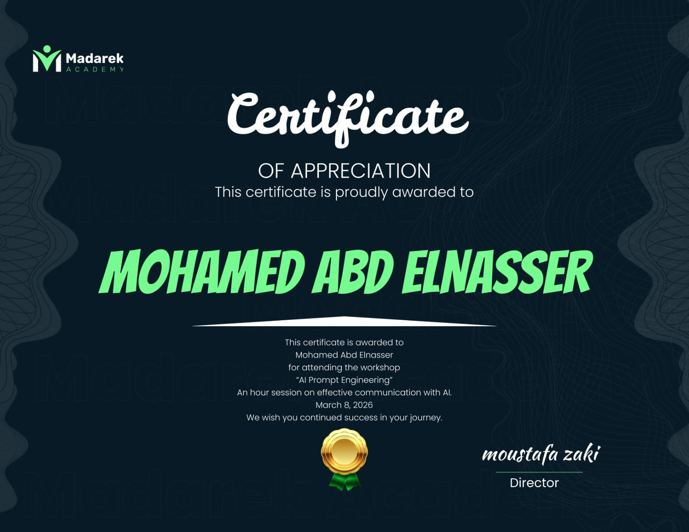
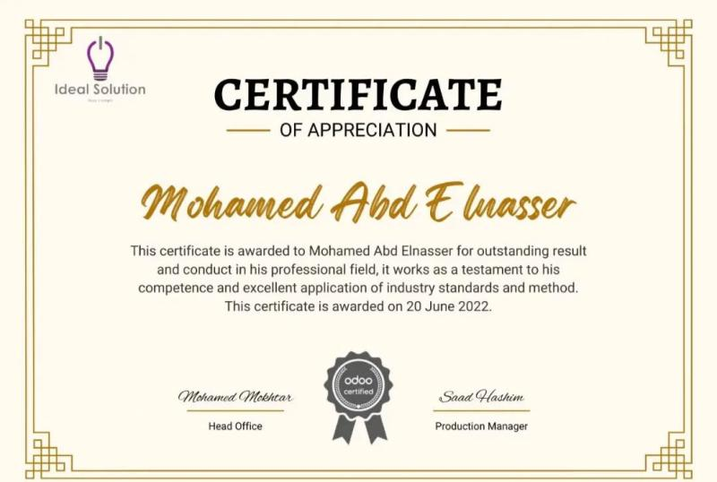
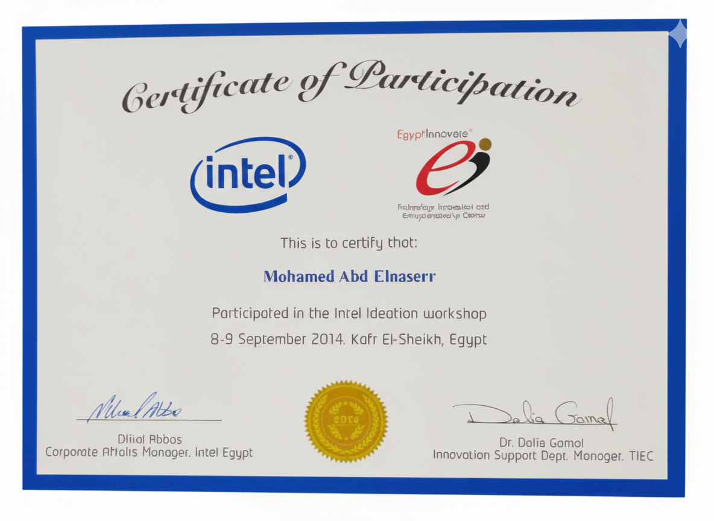
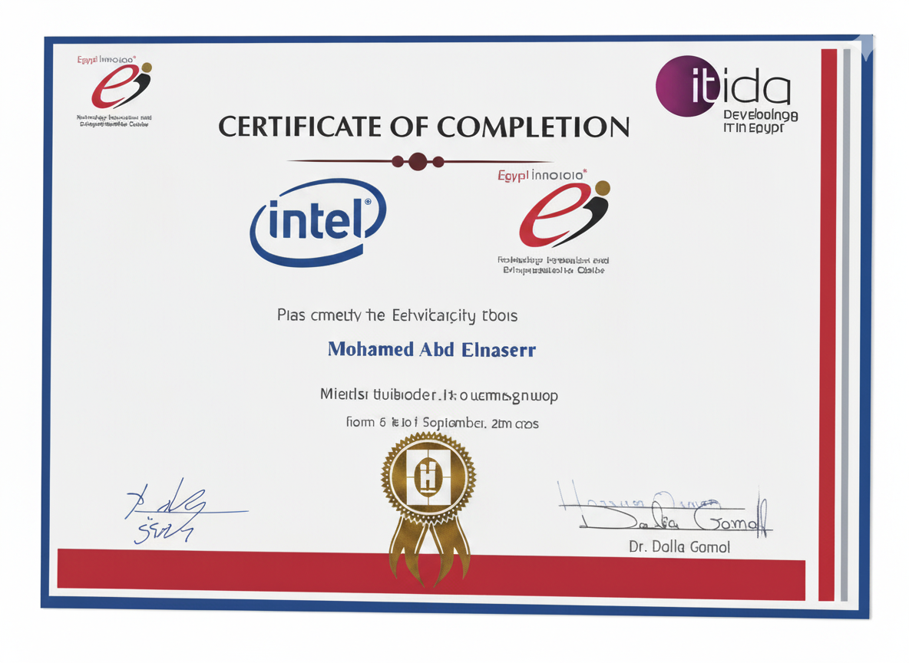

<h1 align="center">Hey 👋 I'm Mohamed Abd Elnasser</h1>

💻 Senior Odoo & Python Developer | ERP Solutions | API Integrations | Mobile Apps (Flutter/Android)

---

## 📜 Certifications & Awards

<table align="center">
  <tr>
    <td align="center">
       
      <b>Madarek Academy</b> Awarded March 8, 2026 "AI Prompt Engineering"
    </td>
  </tr>
  <tr>
    <td align="center">
       
      <b>Ideal Solution</b> Awarded Jun 20, 2022
    </td>
    <td align="center">
       
      <b>AICTEC Advance Int. Co.</b> Awarded Dec 3, 2024
    </td>
    <td align="center">
       
      <b>Innovation Certificate</b>  Awarded sep 9, 2014
    </td>
    <td align="center">
       
      <b>Itida Certificate</b>  Awarded sep 9, 2014
    </td>
  </tr>
</table>

---

## 👨‍💻 About Me
Passionate Software Engineer & Odoo Developer with hands-on experience designing, customizing, and deploying ERP solutions across multiple industries.  
Core strengths: module development, secure record rules, API integrations, performance tuning, and mobile-backend integration.

**Core areas**
- Odoo customization & module development (v12 → v19)  
- Backend: Python, PostgreSQL, ORM patterns, security & record rules  
- Frontend: OWL, XML, QWeb, JavaScript  
- DevOps: Linux, Nginx, SSL/TLS, Docker  
- Mobile: Flutter & Android (Odoo REST APIs)

---

## 🚀 Experience

### **Senior Python Odoo Developer — AICTEC Advance International Co., Saudi Arabia**  
*May 2021 – Present*  
- Designed and customized Odoo ERP solutions (Sales, Inventory, Accounting, CRM).  
- Developed custom modules, implemented record rules & security policies.  
- Generated custom QWeb reports (PDF/XLSX).  
- Integrated Odoo with third-party APIs (REST).  
- Managed server deployment: Linux, Nginx, SSL/TLS.  
- Worked with cross-functional teams to align solutions with business goals.

### **Senior Python Odoo Developer — Touch Business Solutions (Part-Time), Saudi Arabia**  
*Apr 2024 – Sep 2024*  
- Led Odoo team: code reviews, mentoring, and enforcing best practices.  
- Oversaw sprint planning and client delivery.

### **Senior Python Odoo Developer — Top Genius Solutions (Part-Time), Egypt**  
*Oct 2024 – Present*  
- Managed Odoo development team.  
- Task assignment, sprint planning, and code reviews.  
- Trained junior and mid-level developers.

### **Python Odoo Developer — Ideal Solution (Part-Time), Egypt**  
*Jan 2022 – May 2023*  
- Customized and deployed Odoo modules for retail, manufacturing, medical, and education.  
- Developed reports and integrated Odoo with other systems.  

### **Mobile App Technical Lead — Aljeraisy HR, Saudi Arabia**  
*Feb 2021 – Jan 2022*  
- Led Android/iOS mobile app development.  
- Ensured Odoo backend integration with mobile apps.  
- Optimized performance and security.

### **Mobile Android Developer — Mob Leaders Software (Freelance)**  
*2020*  
- Designed and delivered mobile apps integrated with Odoo REST APIs.

---

## 🏢 Client Companies

- **KAF Roasters — Odoo v15** (*Jan 2022 – Present*)  
  Full ERP implementation: Sales, Inventory, Accounting, and POS.

- **WEJHA (Digital Signage CMS Company) — Odoo v16** (*Jan 2023 – Present*)  
  Odoo Framework, Module Development, QWeb Reports, Record Rules, Security.

- **Arsan First Contracting Company — Odoo v16** (*Jan 2024 – Present*)  
  Custom modules and API integrations.

- **Musahm — Odoo v16** (*Dec 2024 – Present*)  
  ERP deployment and system customization.

- **Alam — Odoo v16** (*Jan 2024 – Present*)  
  Industry-specific ERP solutions.

- **Union Systems for Information Technology — Odoo v16** (*Jan 2025 – Present*)  
  End-to-end ERP implementation with advanced security and access control.

- **Leen Alkhair Trading Co.** (*Sep 2020 – May 2021*)  
  Supported food supply & national security mission. Customized Odoo modules and managed deployments.

---

---

## 🏆 Selected Projects
- **Marketko App** — Odoo ERP + POS + Kitchen Display System (KDS)  
- **Al-Attar Restaurant POS** — Fast-food workflows (delivery & takeaway)  
- **Ceramica Platino ERP** — Sales, Inventory, Manufacturing, Accounting  
- **Nrsen Cosmetics ERP** — Batch tracking, expiry management, POS & eCommerce  
- **Cargo Mobile App** — Flutter e-commerce app with Odoo REST backend  
- **REDOS Mobile App** — Android app (integration & maintenance)

---

## 🎓 Education
**B.Sc. Computer & Information Sciences** — Mansoura University  
*2013 – 2017 | GPA: 3.0*

---

## 🛠️ Tech Stack

  
  
  
  
  
  
  

---

## 📬 Contact

  
  
  

