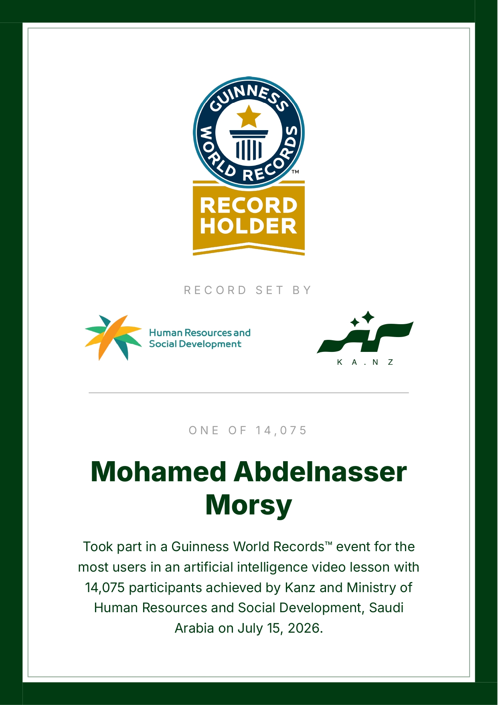
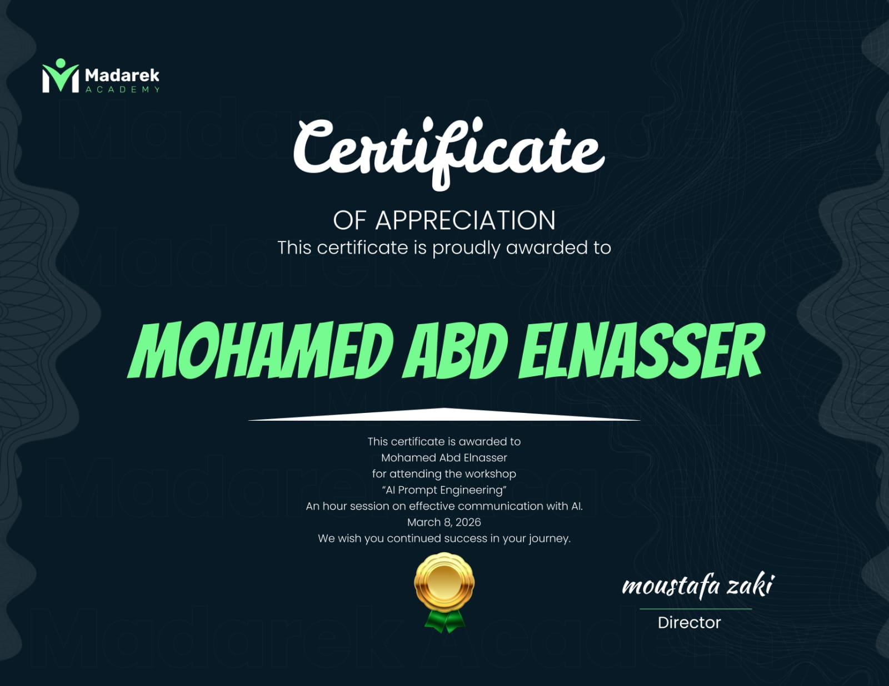
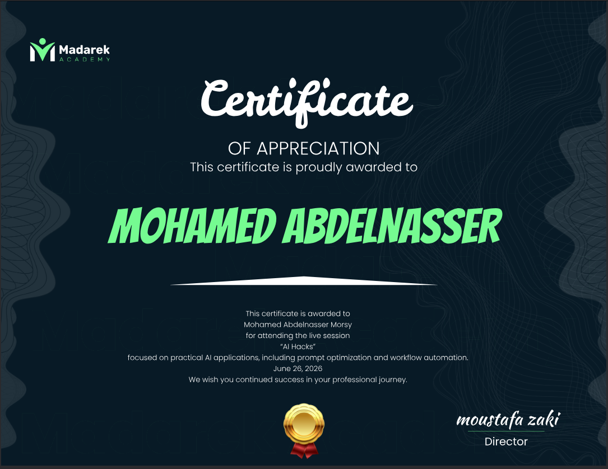
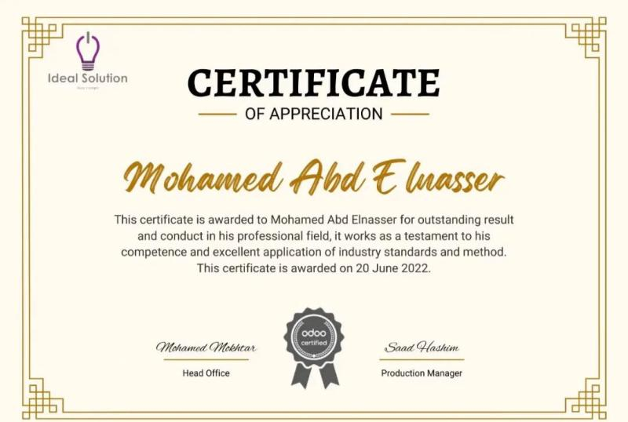
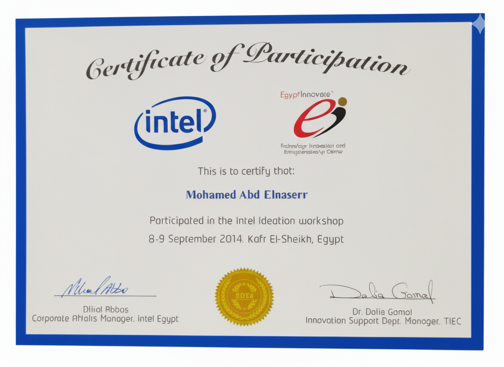
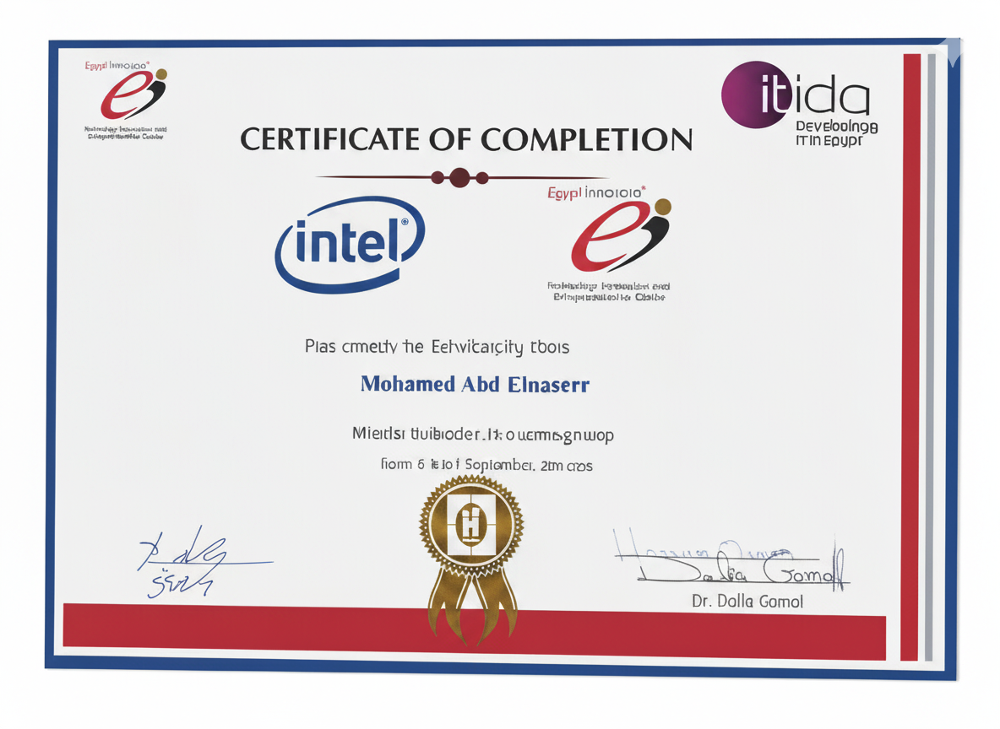

<h1 align="center">Hey 👋 I'm Mohamed Abd Elnasser</h1>

💻 Senior Odoo & Python Developer | ERP Solutions | API Integrations | Mobile Apps (Flutter/Android)

---

<table align="center">

<tr>

<td align="center" colspan="3">

 

<b>KANZ AI & Ministry of Human Resources and Social Development</b> 
Awarded July 15, 2026 
"Guinness World Records™ Event" 
Most users in an AI video lesson 
<b>14,075 Participants</b>

</td>

</tr>

<tr>

<td align="center">

 

<b>KANZ AI</b> 
Awarded July 2026 
AI Training Hackathon 
<b>Featured Project:</b> 
Cargo: Intelligent Logistics & Hyper-Local Marketplace

</td>

<td align="center">

 

<b>Madarek Academy</b> 
Awarded March 8, 2026 
AI Prompt Engineering

</td>

<td align="center">

 

<b>Madarek Academy</b> 
Awarded May 24, 2026 
Generate To Create

</td>

</tr>

<tr>

<td align="center">

 

<b>Madarek Academy</b> 
Awarded June 26, 2026 
AI Hacks

</td>

<td align="center">

 

<b>Ideal Solution</b> 
Awarded Jun 20, 2022

</td>

<td align="center">

 

<b>AICTEC Advance Int. Co.</b> 
Awarded Dec 3, 2024

</td>

</tr>

<tr>

<td align="center">

 

<b>Innovation Certificate</b> 
Awarded Sep 9, 2014

</td>

<td align="center">

 

<b>ITIDA Certificate</b> 
Awarded Sep 9, 2014

</td>

</tr>

</table>

---

## 👨‍💻 About Me

Passionate Software Engineer & Odoo Developer with hands-on experience designing, customizing, and deploying ERP solutions across multiple industries.

Core strengths:
- Module development
- Secure record rules
- API integrations
- Performance tuning
- Mobile-backend integration

**Core areas**

- Odoo customization & module development (v12 → v19)
- Backend: Python, PostgreSQL, ORM patterns, security & record rules
- Frontend: OWL, XML, QWeb, JavaScript
- DevOps: Linux, Nginx, SSL/TLS, Docker
- Mobile: Flutter & Android (Odoo REST APIs)

---

## 🚀 Experience

### **Senior Python Odoo Developer — AICTEC Advance International Co., Saudi Arabia**

*May 2021 – Present*

- Designed and customized Odoo ERP solutions (Sales, Inventory, Accounting, CRM).
- Developed custom modules, implemented record rules & security policies.
- Generated custom QWeb reports (PDF/XLSX).
- Integrated Odoo with third-party APIs (REST).
- Managed server deployment: Linux, Nginx, SSL/TLS.

### **Senior Python Odoo Developer — Touch Business Solutions (Part-Time), Saudi Arabia**

*Apr 2024 – Sep 2024*

- Led Odoo team.
- Code reviews.
- Mentoring developers.
- Sprint planning.

### **Senior Python Odoo Developer — Top Genius Solutions (Part-Time), Egypt**

*Oct 2024 – Present*

- Managed Odoo development team.
- Task assignment.
- Code reviews.
- Developer training.

### **Python Odoo Developer — Ideal Solution (Part-Time), Egypt**

*Jan 2022 – May 2023*

- Customized Odoo modules.
- Developed reports.
- Integrated systems.

### **Mobile App Technical Lead — Aljeraisy HR, Saudi Arabia**

*Feb 2021 – Jan 2022*

- Led Android/iOS development.
- Integrated Odoo backend.
- Improved performance.

### **Mobile Android Developer — Mob Leaders Software**

*2020*

- Developed mobile applications integrated with Odoo APIs.

---

## 🏢 Client Companies

- **KAF Roasters — Odoo v15**
- **WEJHA Digital Signage CMS — Odoo v16**
- **Arsan First Contracting Company — Odoo v16**
- **Musahm — Odoo v16**
- **Alam — Odoo v16**
- **Union Systems for Information Technology — Odoo v16**
- **Leen Alkhair Trading Co.**

---

## 🏆 Selected Projects

- **Marketko App** — Odoo ERP + POS + Kitchen Display System
- **Al-Attar Restaurant POS** — Delivery & takeaway workflow
- **Ceramica Platino ERP** — Sales, Inventory, Manufacturing, Accounting
- **Nrsen Cosmetics ERP** — Batch tracking, expiry, POS & eCommerce
- **Cargo Mobile App** — Flutter + Odoo REST Backend
- **REDOS Mobile App** — Android Integration

---

## 🎓 Education

**B.Sc. Computer & Information Sciences — Mansoura University**

*2013 – 2017 | GPA: 3.0*

---

## 🛠️ Tech Stack

---

## 📬 Contact

